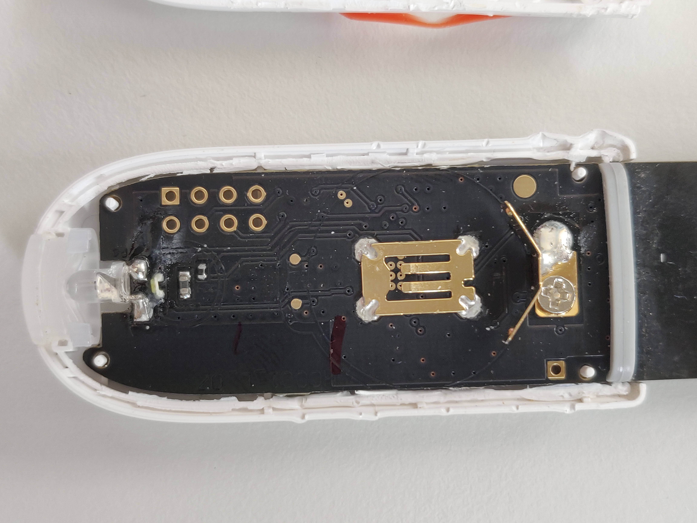

# Xiaomi Flower Care Teardown

This is a teardown of Xiaomi Flower Care (also known as Mi Flora, today sold
VegTrug).

Tipps on how to open: The white housing is sealed toghether, but it can be
broken up by using screw drivers and/or knifes. Best is to start from the bottom
side. The front side (logo side) is hold toghether with the PCB by a screw, but
the battery side is only connected by the seal at the boarder. Hence the battery
side needs to be removed first.

## Pictures

### Front side

### Battery side

## Parts

| PCB  | Part Number           | Manufacturer          | Description          |
|------|-----------------------|-----------------------|----------------------|
| PCB  | HC001_L_06            | HHCC Plant Technology |                      |
| U1   | DA14580 (01 1845NCAB) | Dialog Semiconductor  | Bluetooth Low Energy |
| Y1   |                       |                       | 16MHz Crystal        |
| U1   |                       |                       |                      |

FCC-ID: 2AJEPHHCCJCY01HHCC

### Header Pinout

The device has a pin header P2 accessible.

| Pin  | Description         |
|------|---------------------|
| 1    | VBat (3.3V)         |
| 2    | ?                   |
| 3    | ?                   |
| 4    | ?                   |
| 5    | ?                   |
| 6    | ?                   |
| 7    | GND                 |
| 8    | GND                 |

